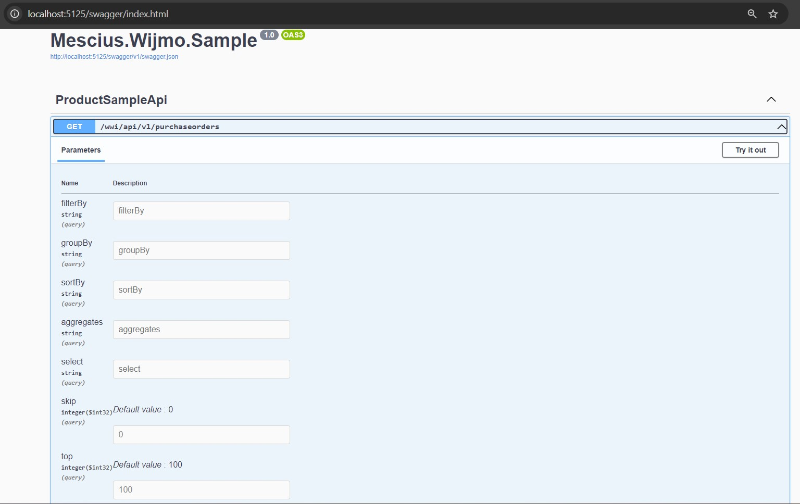

# Mescius.Wijmo.Sample RestApi 
This .NET Core 8.0 based RestApi project can be consumed with Wijmo's RestCollectionView class that lies under wijmo.rest module.

## Prerequisite 

* NET Core 8.0
* Visual Studio 2022

This project provides paginated, sorted and filtered data using local data from data.json placed under Data folder for demo purpose. This demo also provides grouped data.

## Running the App

* Open Mescius.Wijmo.Sample.Sln with VS 2022
* Build the project
* Run the project using F5 key 
* Application is started at [http://localhost:5125](http://localhost:5125)
* It's ready to consumed by RestApi_Client application 
