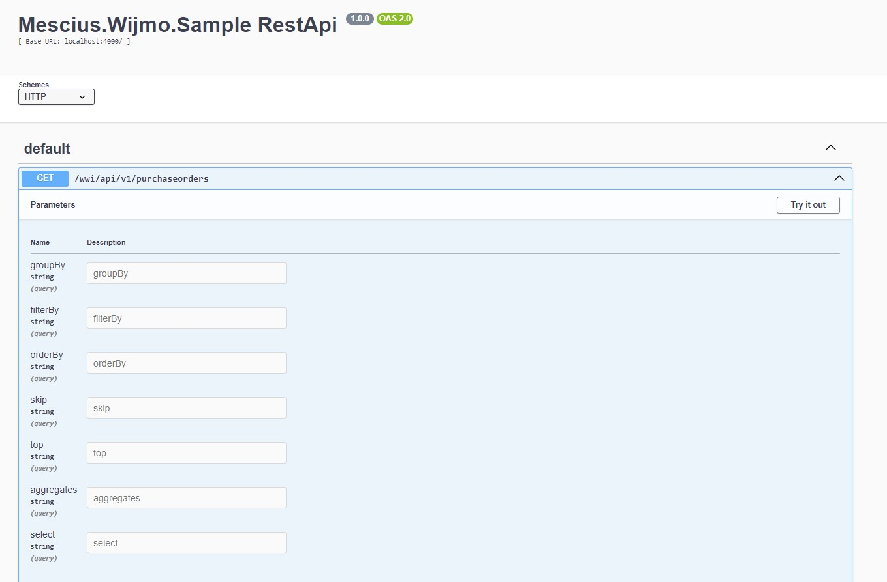

# Mescius.Wijmo.Sample RestApi  
The Node.js based RestApi project can be consumed with Wijmo's RestCollectionView class that lies under wijmo.rest module.

  ## Prerequisites  
  - **Node.js** (version 14.x or later recommended)  
  - **npm** (Node Package Manager, comes with Node.js)  

This project provides paginated, sorted and filtered data using local data from data.js for demo purpose. This demo also provides grouped data. 

Building the Application
---

**Ensure all dependencies are installed:**

    npm install
    
This will install all required packages listed in the package.json file.

Running the Application
----

### Start the server

You have two options for running the server:

 **Production Mode:**

    npm start
    
This command runs the application using Node.js and is suitable for production environments.
    
**Development Mode:**

    npm run dev

This command uses nodemon to automatically restart the server whenever you make changes to your code. It is ideal for development.

### Accessing the API

Once the server is running, the API can be accessed by following url:

http://localhost:4000/wwi/api/v1/purchaseorders
   

This endpoint returns sample data for purchase orders.

### API Documentation

#### /wwi/api/v1/purchaseorders

*   **Method:** GET
    
*   **Description:** Returns sample data for purchase orders.
    

Additional Information
----------------------

**Port Configuration:** By default, the server will run on port 4000. If you want to run it on a different port, modify the index.js file to listen on your desired port.
    

Dependencies
------------

*   **express**: Web framework for Node.js.
    
*   **cors**: Middleware to enable CORS (Cross-Origin Resource Sharing).
    
*   **nodemon**: Tool for automatically restarting the server in development mode.
